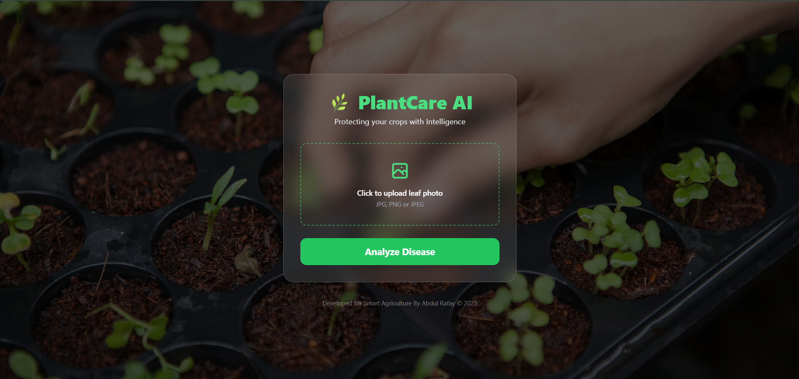

# 🌿 PlantCare AI: Smart Agriculture Disease Detection

PlantCare AI is an industrial-grade automated solution designed to tackle agricultural yield loss. Leveraging Deep Learning and high-performance hardware, the system identifies **38 different categories** of healthy and diseased leaves with an impressive **93% precision**, providing instant diagnosis and actionable solutions.



## 🌟 What's New? (V2.0 Update)
- **Modern Web Interface:** Shifted from Gradio to a fully custom **Glassmorphism UI** using Tailwind CSS.
- **Real-time Diagnosis:** Instant leaf examination with confidence scoring.
- **Actionable Insights:** Not just detection, the system now provides specific **Descriptions** and **Recommended Actions (Solutions)** for each disease.

## 📊 Key Performance Metrics
- **Validation Accuracy:** ~93% (92.85%)
- **Weighted Average F1-Score:** 0.93
- **Dataset:** 54,305 high-resolution images from the **PlantVillage Dataset**.
- **Hardware Optimization:** Trained and optimized using **NVIDIA GeForce RTX 3090 GPU**.

## 🏗️ Methodology & Architecture
The system utilizes a custom **Convolutional Neural Network (CNN)** specifically tuned for plant pathology:
- **Input Layer:** 256x256 RGB images.
- **Feature Extraction:** Multi-layer CNN identifying intricate patterns like leaf spots, chlorosis, and textures.
- **Output Layer:** Softmax activation providing probabilities across 38 distinct classes.

## 💻 Tech Stack
- **Deep Learning:** TensorFlow / Keras (Core Engine).
- **Backend:** Flask (Python).
- **Frontend:** HTML5, Tailwind CSS (Glass-card Design), JavaScript (Async API Fetch).
- **Hardware Acceleration:** oneDNN optimized for RTX 3090.

## ⚡ Execution & Installation

### 1. Installation

    ```bash```
    git clone [https://github.com/abdulrafayza01/Plant-Disease-Detection-RTX3090.git](https://github.com/abdulrafayza01/Plant-Disease-Detection-RTX3090.git)

    cd Plant-Disease-Detection-RTX3090

    pip install -r requirements.txt

### 2. Run the Application

    Standard Run: python app.py

    VS Code (F5): Pre-configured with launch.json for one-click debugging.

📈 Results & Visualizations
The model successfully identifies complex diseases like Tomato Late Blight. Detailed training history (Accuracy/Loss curves) is documented in the plant_disease.ipynb notebook.

Developed with ❤️ for Smart Agriculture by Abdul Rafay